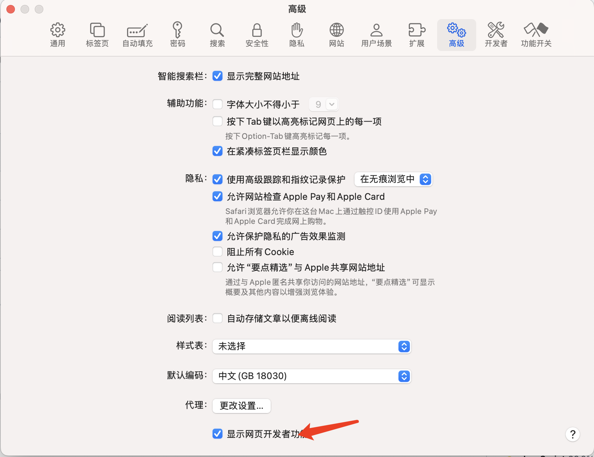
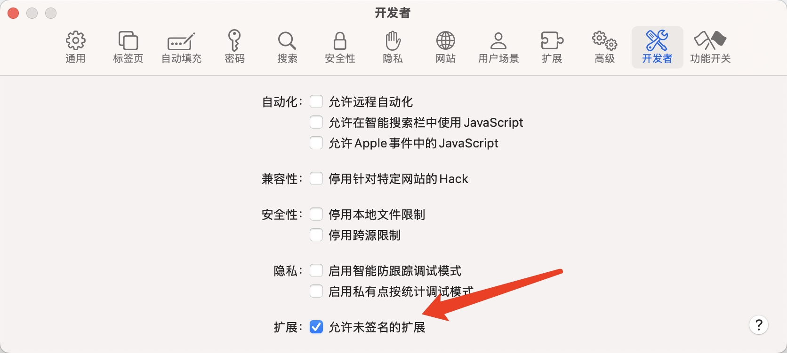
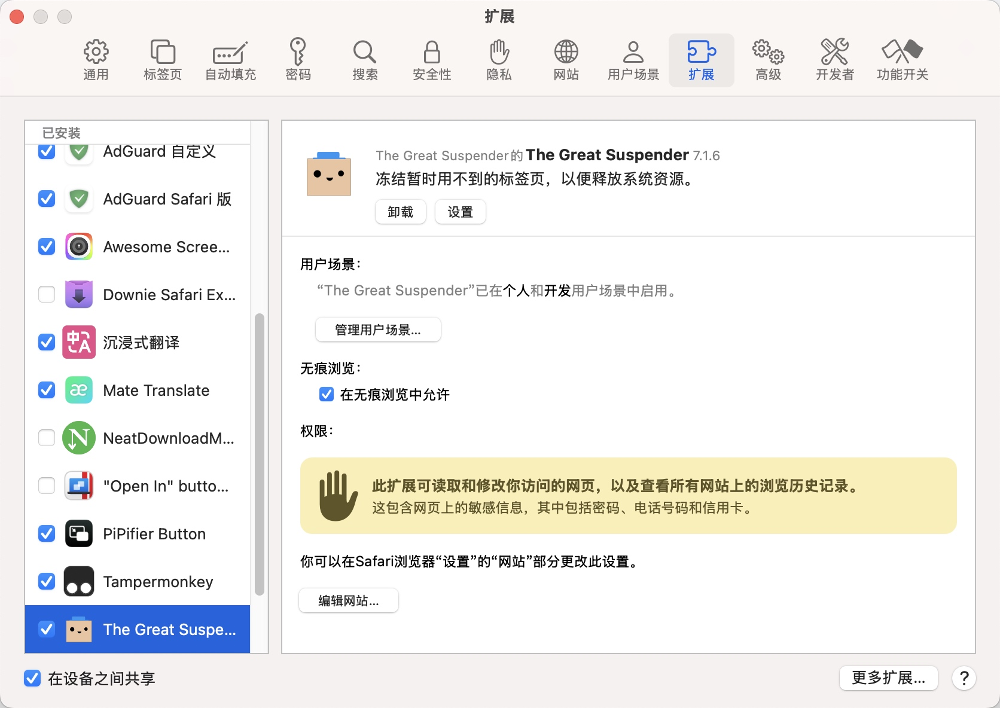

# The Great Suspender - Safari 标签页休眠插件

The Great Suspender 是一个 Safari 插件，用于休眠长时间未使用的标签页，从而节省系统资源。本指南介绍如何在 Xcode 中启动并编译该项目。

## 项目文件结构
```
The Great Suspender/
├── README.md                # 项目说明文档
├── tgs-7.1.6/               # 插件的资源文件
├── tgs-7.1.6.zip            # 插件资源的压缩包
├── The Great Suspender/      # 项目主目录
│   ├── iOS (App)/           # iOS App 的代码文件夹
│   ├── iOS (Extension)/     # iOS 插件的代码文件夹
│   ├── macOS (App)/         # macOS App 的代码文件夹
│   ├── macOS (Extension)/   # macOS 插件的代码文件夹
│   ├── Shared (App)/        # iOS 和 macOS App 的共享代码
│   ├── Shared (Extension)/  # iOS 和 macOS 插件的共享代码
│   └── The Great Suspender.xcodeproj # Xcode 项目文件
```

### 文件夹说明
- **README.md**: 项目文档，包含插件的基本信息和使用说明。
- **tgs-7.1.6**: 版本文件夹，包含插件的相关文件和资源。
- **The Great Suspender**: 插件的主项目文件夹，包含多个平台的实现。
  - **iOS (App)**: iOS 应用的主代码。
  - **iOS (Extension)**: iOS 的扩展部分。
  - **macOS (App)**: macOS 应用的主代码。
  - **macOS (Extension)**: macOS 的扩展部分。
  - **Shared (App)**: 跨平台共享的应用代码。
  - **Shared (Extension)**: 跨平台共享的扩展代码。
  - **The Great Suspender.xcodeproj**: Xcode 项目文件，包含了所有的编译和构建配置。

## 使用 Xcode 启动和编译项目

### 前置条件
1. 确保已安装最新版本的 [Xcode](https://developer.apple.com/xcode/)。
2. 安装 Safari 扩展所需的必要依赖。

### 步骤

1. **打开项目文件**  
   双击 `The Great Suspender.xcodeproj` 文件以在 Xcode 中打开项目。

2. **选择构建目标**  
   在 Xcode 的左上角，选择你要构建的目标平台（如 iOS、macOS），然后选择对应的 Scheme，例如 "The Great Suspender (iOS)" 或 "The Great Suspender (macOS)"。

3. **配置签名**  
   - 打开项目设置，选择 "Signing & Capabilities"。
   - 选择你的 Apple 开发者账户并配置签名，以便在真实设备上运行。

4. **构建项目**  
   - 点击左上角的 "Build" 按钮，或使用快捷键 `Command + B`，开始构建项目。
   - Xcode 将会下载所需的依赖，并编译项目。

5. **运行插件**  
   - 在构建成功后，可以点击 "Run" 按钮（`Command + R`）在模拟器或连接的设备上运行插件。
   - 对于 Safari 插件，需打开 Safari 的扩展设置来启用该插件。

### 常见问题

- **依赖缺失**  
  如果在构建过程中遇到依赖缺失的问题，请确保你已安装所有的项目依赖库，并尝试再次构建。

- **签名错误**  
  请确保使用正确的 Apple 开发者账户，并配置签名设置。
  
- **Safari找不的插件**
开启开发者功能

允许未签名的拓展

拓展中就可以看到了


## 许可证

本项目的许可证信息请查看 `README.md` 文件或联系项目维护者。

---

如果在使用过程中遇到问题，请参考相关的 Xcode 文档或联系项目维护者。